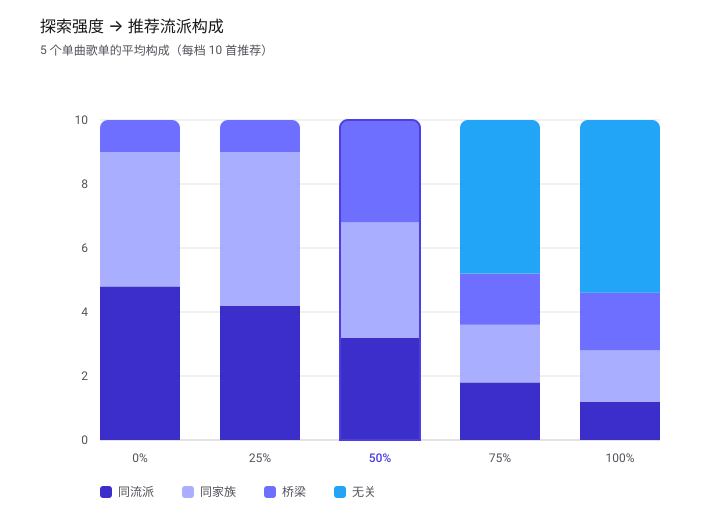

# 推荐算法说明

> 闻野 OpenEar 的推荐歌单**完全由纯规则算法生成**，LLM 不参与排序。
> LLM 只在最后一步润色理由文案，且带 8 秒超时——超时或失败就退回规则文案。
> 所有数据存于本地 JSON，无外部数据库、无外部 API。

---

## 一、两个基准：全部从你的歌单算出来

| 基准 | 怎么算 | 用途 |
|---|---|---|
| 平均口味 | 歌单里所有歌的 `valence`（愉悦度）、`arousal`（能量）分别取平均 | 情绪平面上的「圆心」 |
| 口味流派 | 统计歌单各流派占比，取 Top 3 | 判断「同流派 / 同家族 / 桥梁 / 无关」 |

**流派距离**是固定四级（`lib/lib/metrics.ts`）：

| 距离 | 含义 |
|---|---|
| 0 | 同流派 |
| 1 | 同家族（风格相邻） |
| 2 | 桥梁流派（可过渡） |
| 3 | 无关 |

---

## 二、探索强度 → 三个参数

强度是 0–100 的连续值，在三个锚点之间线性插值（`getIntensityParams`）：

| 强度 | 流派距离上限 | 离家百分位 | 熟悉度权重 | 语义 |
|---|---|---|---|---|
| 0% | 1 | 0 | 0.75 | 贴身：只留同流派/同家族，每个方向取最近的歌 |
| 50% | 2 | 0.5 | 0.4 | 平衡：可跨到桥梁流派，取中位距离 |
| 100% | 4 | 1 | 0.1 | 野探：全库放开，每个方向取最远的歌 |

三个参数的作用：

- **流派距离上限** —— 技术层，决定候选池里允许出现多远流派。
- **离家百分位** —— 情绪层，每个方向取「离家距离的第 p 百分位」的歌，p 越大取越远。
- **熟悉度权重** —— 行为层，距离并列时决定优先选熟悉的还是陌生的。

---

## 三、四步选歌

### ① 建候选池

先排除歌单里已经有的歌，再只保留「流派距离 ≤ 上限」的。
**如果符合条件的不够 10 首，就按流派距离由近到远补足**——而不是一次性放开到全库。
（后者会让 Post-Rock 这类稀疏流派在低强度混进一堆无关歌，比高强度还远。）

### ② 环形放射选点（核心）

以你的平均口味为圆心，把 360° 切成 10 个扇区。每个扇区内部，把候选歌按「离家距离」
从近到远排序，取第 `离家百分位` 那一首。于是：

- 强度越高，每个方向取到的歌越远 → 离家更远、跨象限更多；
- 每个方向都有歌 → 结果是一条环绕发散的路线，而不是扎堆在一个角落；
- 距离并列时按熟悉度打平手（低强度选熟悉的，高强度选陌生的）。

### ③ 流派保底配额

只靠 ① 的池子过滤是不够的：最终挑哪 10 首由 ② 的情绪取点决定，**流派不参与挑选**，
所以 50% 也可能一首同流派都不剩。因此加了一层硬性配额：

| 强度 | 保底同流派 | 保底同流派或同家族 |
|---|---|---|
| 0% | 5 首 | 10 首 |
| 50% | 3 首 | 5 首 |
| 100% | 0 首 | 0 首 |

不足时，把「跨流派最远」的几首替换成贴近口味的候选；换入时优先挑半径与角度都接近的，
尽量不打乱环形路线形状。

### ④ 生成三层理由

| 层 | 依据 | 示例 |
|---|---|---|
| 技术层 | BPM 对比歌单平均节奏 | 「BPM 88，和你歌单的平均节奏很接近」 |
| 情绪层 | 情绪标签 + VA 距离 | 「从平和(0.42) → 兴奋(0.78)，情绪距离 0.39」 |
| 行为层 | 歌单里有几首同流派 | 「你歌单里已有 3 首 Lo-fi，这首是同一片地带的邻居」 |

理由**只陈述歌单里真实存在的事实**，不编造收听历史、播放次数、收听时间。

---

## 四、实测数据

复现方式：

```bash
node node_modules/esbuild/bin/esbuild scripts/_repro-genre.ts \
  --bundle --platform=node --format=esm --outdir=scripts/.build --packages=external
node scripts/.build/_repro-genre.js
```

每个歌单只放 1 首目标流派的歌，看不同强度下 10 首推荐的流派构成。
单元格格式：**同流派 / 同家族 / 桥梁 / 无关**。

| 歌单流派 | 0% | 25% | 50% | 75% | 100% |
|---|---|---|---|---|---|
| Ambient | 5/5/0/0 | 5/5/0/0 | 3/4/3/0 | 3/2/0/5 | 3/2/0/5 |
| Lo-fi | 5/5/0/0 | 4/6/0/0 | 3/7/0/0 | 1/3/0/6 | 2/3/0/5 |
| K-pop | 7/3/0/0 | 5/5/0/0 | 3/3/4/0 | 1/2/4/3 | 0/1/3/6 |
| Post-Rock | 5/0/5/0 | 5/0/5/0 | 5/0/5/0 | 3/0/2/5 | 1/0/3/6 |
| Soul | 2/8/0/0 | 2/8/0/0 | 2/4/4/0 | 1/2/2/5 | 0/2/3/5 |
| **平均** | 4.8/4.2/1.0/0 | 4.2/4.8/1.0/0 | 3.2/3.6/3.2/0 | 1.8/1.8/1.6/4.8 | 1.2/1.6/1.8/5.4 |



读法：

- **同流派**从 4.8 首单调降到 1.2 首，**无关**从 0 升到 5.4 首 → 强度确实在控制「离家多远」。
- **50% 处平均仍有 3.2 首同流派**，即「平衡档也保留同类型歌曲」，不会清一色跨流派。
- Soul 50% 只有 2 首同流派、Post-Rock 同家族恒为 0 —— 这是曲库里这两个流派本身歌太少、
  没有家族流派导致的数据量限制，不是算法问题。

---

## 五、硬约束

1. 排序**纯规则**，LLM 不参与（只在最后润色理由文案，8 秒超时退回规则文案）。
2. 理由不虚构播放次数、收听时间、收听历史。
3. 数据全在本地 JSON，无外部数据库 / API。
4. 界面不展示实现细节（运行路径、方法名、技术注记）。

---

## 六、代码位置

| 文件 | 作用 |
|---|---|
| `lib/lib/recommendations.ts` | 推荐引擎主流程：强度插值、环形放射选点、流派保底配额 |
| `lib/lib/metrics.ts` | 流派距离、VA 距离、熟悉度、空白区定义 |
| `scripts/_repro-genre.ts` | 流派分布复现脚本（本文档第四节数据来源） |
| `scripts/recommendations.test.ts` | 单元测试：参数单调性、离家距离单调性 |